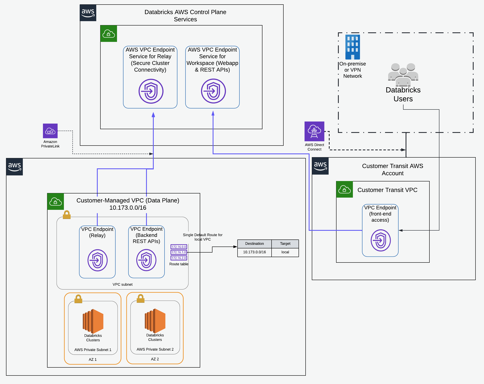

E2 pattern with AWS Private Link

This reference architecture can be described as the following diagram:

#### Modules

| Name | Source | Version |
|------|--------|---------|
|  [vpc](#module_vpc) | terraform-aws-modules/vpc/aws | 2.70.0 |
|  [vpc_endpoints](#module_vpc_endpoints) | terraform-aws-modules/vpc/aws//modules/vpc-endpoints | 3.2.0 |

#### Resources

| Name | Type |
|------|------|
| [aws_iam_role.cross_account_role](https://registry.terraform.io/providers/hashicorp/aws/latest/docs/resources/iam_role) | resource |
| [aws_iam_role_policy.this](https://registry.terraform.io/providers/hashicorp/aws/latest/docs/resources/iam_role_policy) | resource |
| [aws_route_table.this](https://registry.terraform.io/providers/hashicorp/aws/latest/docs/resources/route_table) | resource |
| [aws_route_table_association.dataplane_vpce_rtb](https://registry.terraform.io/providers/hashicorp/aws/latest/docs/resources/route_table_association) | resource |
| [aws_s3_bucket.root_storage_bucket](https://registry.terraform.io/providers/hashicorp/aws/latest/docs/resources/s3_bucket) | resource |
| [aws_s3_bucket_policy.root_bucket_policy](https://registry.terraform.io/providers/hashicorp/aws/latest/docs/resources/s3_bucket_policy) | resource |
| [aws_s3_bucket_public_access_block.root_storage_bucket](https://registry.terraform.io/providers/hashicorp/aws/latest/docs/resources/s3_bucket_public_access_block) | resource |
| [aws_security_group.dataplane_vpce](https://registry.terraform.io/providers/hashicorp/aws/latest/docs/resources/security_group) | resource |
| [aws_subnet.dataplane_vpce](https://registry.terraform.io/providers/hashicorp/aws/latest/docs/resources/subnet) | resource |
| [aws_vpc_endpoint.backend_rest](https://registry.terraform.io/providers/hashicorp/aws/latest/docs/resources/vpc_endpoint) | resource |
| [aws_vpc_endpoint.relay](https://registry.terraform.io/providers/hashicorp/aws/latest/docs/resources/vpc_endpoint) | resource |
| [databricks_mws_credentials.this](https://registry.terraform.io/providers/databrickslabs/databricks/latest/docs/resources/mws_credentials) | resource |
| [databricks_mws_networks.this](https://registry.terraform.io/providers/databrickslabs/databricks/latest/docs/resources/mws_networks) | resource |
| [databricks_mws_private_access_settings.pas](https://registry.terraform.io/providers/databrickslabs/databricks/latest/docs/resources/mws_private_access_settings) | resource |
| [databricks_mws_storage_configurations.this](https://registry.terraform.io/providers/databrickslabs/databricks/latest/docs/resources/mws_storage_configurations) | resource |
| [databricks_mws_vpc_endpoint.backend_rest_vpce](https://registry.terraform.io/providers/databrickslabs/databricks/latest/docs/resources/mws_vpc_endpoint) | resource |
| [databricks_mws_vpc_endpoint.relay](https://registry.terraform.io/providers/databrickslabs/databricks/latest/docs/resources/mws_vpc_endpoint) | resource |
| [databricks_mws_workspaces.this](https://registry.terraform.io/providers/databrickslabs/databricks/latest/docs/resources/mws_workspaces) | resource |
| [aws_availability_zones.available](https://registry.terraform.io/providers/hashicorp/aws/latest/docs/data-sources/availability_zones) | data source |
| [databricks_aws_assume_role_policy.this](https://registry.terraform.io/providers/databrickslabs/databricks/latest/docs/data-sources/aws_assume_role_policy) | data source |
| [databricks_aws_bucket_policy.this](https://registry.terraform.io/providers/databrickslabs/databricks/latest/docs/data-sources/aws_bucket_policy) | data source |
| [databricks_aws_crossaccount_policy.this](https://registry.terraform.io/providers/databrickslabs/databricks/latest/docs/data-sources/aws_crossaccount_policy) | data source |

#### Inputs

| Name | Description | Type | Default |
|------|-------------|------|---------|
|  [cidr_block_private](#input_cidr_block_private) | n/a | `string` | `"10.1.0.0/16"` |
|  [cidr_block_public](#input_cidr_block_public) | n/a | `string` | `"10.2.0.0/16"` |
|  [databricks_account_id](#input_databricks_account_id) | n/a | `any` | n/a |
|  [databricks_account_password](#input_databricks_account_password) | n/a | `any` | n/a |
|  [databricks_account_username](#input_databricks_account_username) | n/a | `any` | n/a |
|  [private_dns_enabled](#input_private_dns_enabled) | n/a | `bool` | `false` |
|  [project_env](#input_project_env) | n/a | `list(string)` | `"dev"` |
|  [project_name](#input_project_name) | n/a | `string` | `"demo"` |
|  [project_subnets_range_private](#input_project_subnets_range_private) | 3 for small, 6 for medium and 8 for large for a /16 cidr_block | `number` | `3` |
|  [project_subnets_range_public](#input_project_subnets_range_public) | 3 for small, 6 for medium and 8 for large for a /16 cidr_block | `number` | `3` |
|  [region](#input_region) | n/a | `string` | `"eu-west-1"` |
|  [relay_vpce_service](#input_relay_vpce_service) | n/a | `any` | n/a |
|  [tags](#input_tags) | n/a | `map` | `{}` |
|  [team](#input_team) | Team that performs the work | `string` | `"tf"` |
|  [vpce_subnet_cidr](#input_vpce_subnet_cidr) | n/a | `string` | `"10.3.0.0/16"` |
|  [workspace_vpce_service](#input_workspace_vpce_service) | n/a | `any` | n/a |

#### Outputs

| Name | Description |
|------|-------------|
|  [crossaccount_role_name](#output_crossaccount_role_name) | n/a |
|  [databricks_host](#output_databricks_host) | n/a |
