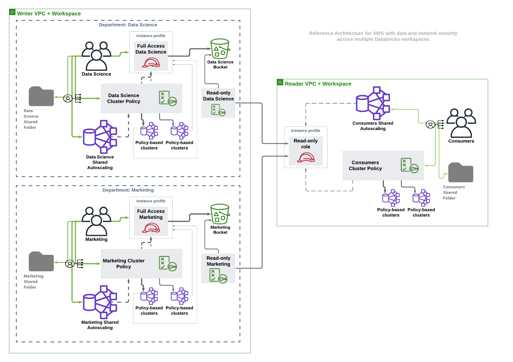

E2 pattern with two VPCs and two workspaces with fully-featured security measures

This reference architecture can be described as the following diagram:

#### Modules

| Name | Source | Version |
|------|--------|---------|
|  [crossaccount](#module_crossaccount) | ../aws-databricks-crossaccount | n/a |
|  [data_consumers](#module_data_consumers) | ./consumers | n/a |
|  [data_creators](#module_data_creators) | ./creators | n/a |
|  [reader_workspace](#module_reader_workspace) | ./workspace | n/a |
|  [root_bucket](#module_root_bucket) | ../aws-databricks-bucket | n/a |
|  [vpc](#module_vpc) | ./vpc | n/a |
|  [vpc_reader](#module_vpc_reader) | ./vpc | n/a |
|  [workspace](#module_workspace) | ./workspace | n/a |

#### Resources

No resources.

#### Inputs

| Name | Description | Type | Default |
|------|-------------|------|---------|
|  [aws_region](#input_aws_region) | n/a | `any` | n/a |
|  [aws_zone](#input_aws_zone) | n/a | `any` | n/a |
|  [cidr](#input_cidr) | n/a | `string` | `"10.1.0.0/16"` |
|  [databricks_cloud_password](#input_databricks_cloud_password) | n/a | `any` | n/a |
|  [databricks_cloud_username](#input_databricks_cloud_username) | n/a | `any` | n/a |
|  [databricks_external_id](#input_databricks_external_id) | External ID you find on https://accounts.cloud.databricks.com/#aws | `string` | n/a |
|  [name](#input_name) | n/a | `any` | n/a |
|  [prefix](#input_prefix) | n/a | `any` | n/a |
|  [tags](#input_tags) | Tags applied to all resources created | `map(string)` | n/a |

#### Outputs

| Name | Description |
|------|-------------|
|  [reader_workspace_url](#output_reader_workspace_url) | n/a |
|  [workspace_url](#output_workspace_url) | n/a |
