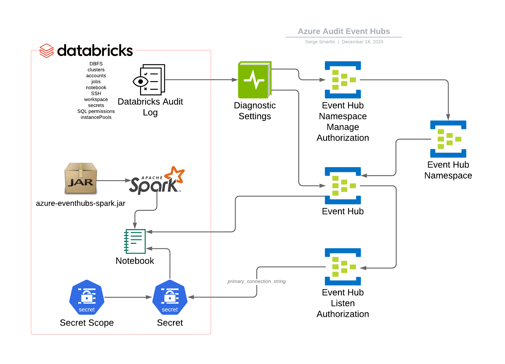

Azure EventHubs for structured streaming

This module creates:
* Diagnostic setting to forward into Event Hub (EH)
* EH Namespace with single Event Hub
* Databricks Secret Scope
* Databricks Cluster with corresponding JAR installed
* Secret with EH Namespace connection string composed out of `...`

#### Modules

No modules.

#### Resources

| Name | Type |
|------|------|
| [azurerm_eventhub.this](https://registry.terraform.io/providers/hashicorp/azurerm/latest/docs/resources/eventhub) | resource |
| [azurerm_eventhub_authorization_rule.listen](https://registry.terraform.io/providers/hashicorp/azurerm/latest/docs/resources/eventhub_authorization_rule) | resource |
| [azurerm_eventhub_namespace.this](https://registry.terraform.io/providers/hashicorp/azurerm/latest/docs/resources/eventhub_namespace) | resource |
| [azurerm_eventhub_namespace_authorization_rule.manage](https://registry.terraform.io/providers/hashicorp/azurerm/latest/docs/resources/eventhub_namespace_authorization_rule) | resource |
| [azurerm_monitor_diagnostic_setting.eventhub](https://registry.terraform.io/providers/hashicorp/azurerm/latest/docs/resources/monitor_diagnostic_setting) | resource |
| [databricks_cluster.this](https://registry.terraform.io/providers/databrickslabs/databricks/latest/docs/resources/cluster) | resource |
| [databricks_notebook.process_in_scala](https://registry.terraform.io/providers/databrickslabs/databricks/latest/docs/resources/notebook) | resource |
| [databricks_secret.this](https://registry.terraform.io/providers/databrickslabs/databricks/latest/docs/resources/secret) | resource |
| [databricks_secret_scope.this](https://registry.terraform.io/providers/databrickslabs/databricks/latest/docs/resources/secret_scope) | resource |
| [azurerm_eventhub_namespace_authorization_rule.root](https://registry.terraform.io/providers/hashicorp/azurerm/latest/docs/data-sources/eventhub_namespace_authorization_rule) | data source |
| [azurerm_resource_group.this](https://registry.terraform.io/providers/hashicorp/azurerm/latest/docs/data-sources/resource_group) | data source |
| [databricks_node_type.smallest](https://registry.terraform.io/providers/databrickslabs/databricks/latest/docs/data-sources/node_type) | data source |

#### Inputs

| Name | Description | Type | Default |
|------|-------------|------|---------|
|  [categories](#input_categories) | Databricks diagnostic log categories (all by default) | `list` | <pre>[   "dbfs",   "clusters",   "accounts",   "jobs",   "notebook",   "ssh",   "workspace",   "secrets",   "sqlPermissions",   "instancePools" ]</pre> |
|  [databricks_resource_id](#input_databricks_resource_id) | The Azure resource ID for the databricks workspace deployment. | `any` | n/a |
|  [retention](#input_retention) | Days to keep diagnostics | `number` | `3` |

#### Outputs

No outputs.
