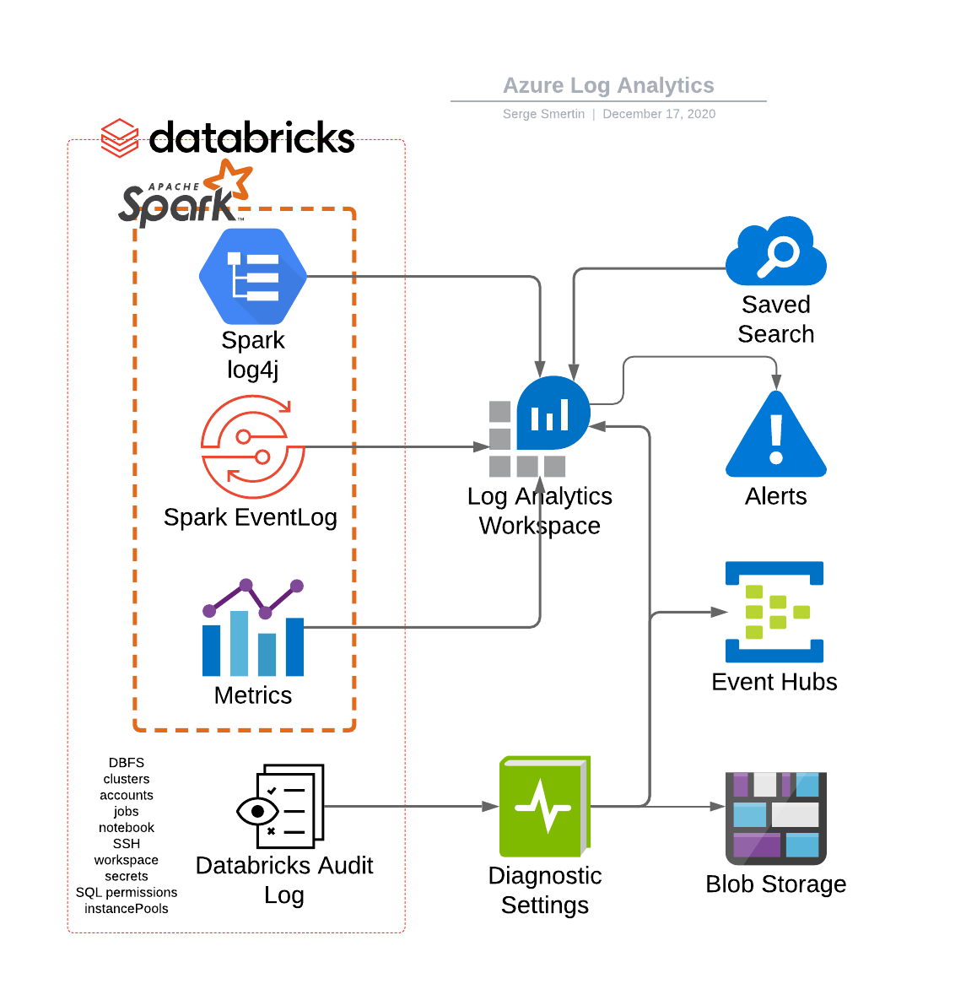
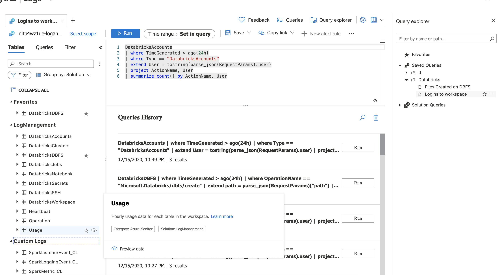

Creates Azure Log Analytics workspace and integrates it with Azure Databricks through init scripts

This solution accelerator downloads latest spark streaming listeners and log analytics Log4j appender repository,
builds it with Maven, uploads the JARs to dbfs:/FileStore/jars/monitoring. Then it creates initi scripts, that
collect metrics from JVMs using those JARs, as well as LogAnalytics OMS agent to collect VM-level metrics, like
memory utilization and CPU load.

To speed up some of the analysis, this module pre-creates couple of saved search queries for Log Analytics search
interface.

Blogs:
- https://cloudarchitected.com/2019/04/monitoring-azure-databricks/
- https://github.com/AdamPaternostro/Azure-Databricks-Log4J-To-AppInsights

Last tested on 2020-12-15

#### Modules

No modules.

#### Resources

| Name | Type |
|------|------|
| [azurerm_log_analytics_saved_search.query](https://registry.terraform.io/providers/hashicorp/azurerm/latest/docs/resources/log_analytics_saved_search) | resource |
| [azurerm_log_analytics_workspace.this](https://registry.terraform.io/providers/hashicorp/azurerm/latest/docs/resources/log_analytics_workspace) | resource |
| [azurerm_monitor_diagnostic_setting.log_analytics](https://registry.terraform.io/providers/hashicorp/azurerm/latest/docs/resources/monitor_diagnostic_setting) | resource |
| [databricks_cluster.sample](https://registry.terraform.io/providers/databrickslabs/databricks/latest/docs/resources/cluster) | resource |
| [databricks_dbfs_file.init_scripts](https://registry.terraform.io/providers/databrickslabs/databricks/latest/docs/resources/dbfs_file) | resource |
| [databricks_dbfs_file.listeners](https://registry.terraform.io/providers/databrickslabs/databricks/latest/docs/resources/dbfs_file) | resource |
| [databricks_global_init_script.init2](https://registry.terraform.io/providers/databrickslabs/databricks/latest/docs/resources/global_init_script) | resource |
| [azurerm_resource_group.this](https://registry.terraform.io/providers/hashicorp/azurerm/latest/docs/data-sources/resource_group) | data source |
| [databricks_node_type.smallest](https://registry.terraform.io/providers/databrickslabs/databricks/latest/docs/data-sources/node_type) | data source |
| [external_external.build_jars](https://registry.terraform.io/providers/hashicorp/external/latest/docs/data-sources/external) | data source |

#### Inputs

| Name | Description | Type | Default |
|------|-------------|------|---------|
|  [categories](#input_categories) | Databricks diagnostic log categories (all by default) | `list` | <pre>[   "dbfs",   "clusters",   "accounts",   "jobs",   "notebook",   "ssh",   "workspace",   "secrets",   "sqlPermissions",   "instancePools" ]</pre> |
|  [databricks_resource_id](#input_databricks_resource_id) | The Azure resource ID for the databricks workspace deployment. | `any` | n/a |
|  [log4j](#input_log4j) | Ship Driver/Executor Log4j logs to LogAnalytics workspace | `bool` | `true` |
|  [retention](#input_retention) | Days to keep diagnostics | `number` | `3` |
|  [spark_metrics](#input_spark_metrics) | Ship Spark Dropwizzard metrics | `bool` | `true` |
|  [spark_metrics_period](#input_spark_metrics_period) | Dropwizzard metric collection interval. Requires `spark_metrics = true` | `number` | `60` |
|  [vm_metrics](#input_vm_metrics) | Ship Azure VM metrics, like CPU load and available memory | `bool` | `true` |

#### Outputs

No outputs.
